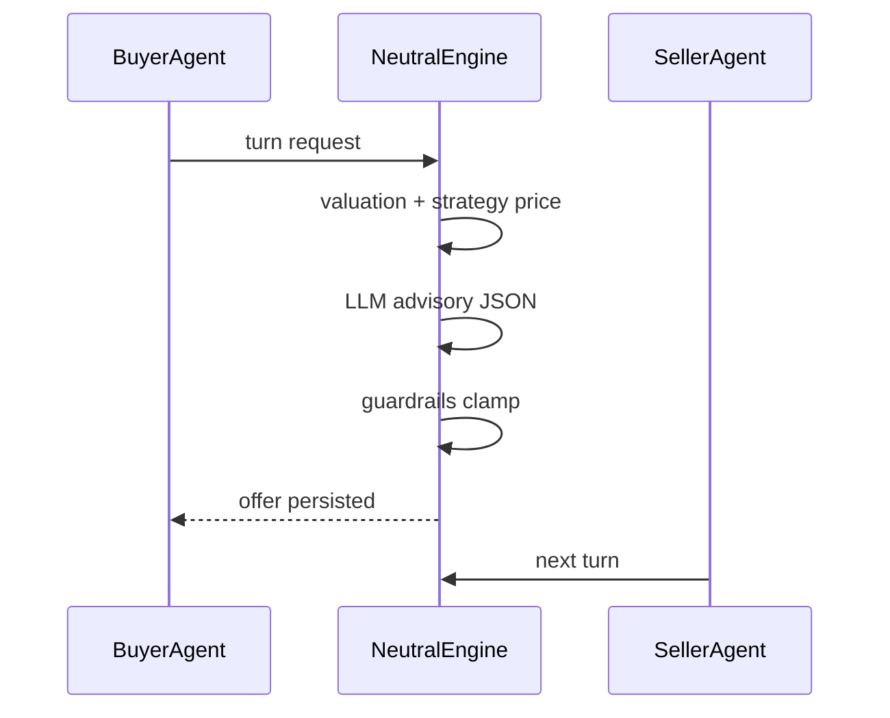
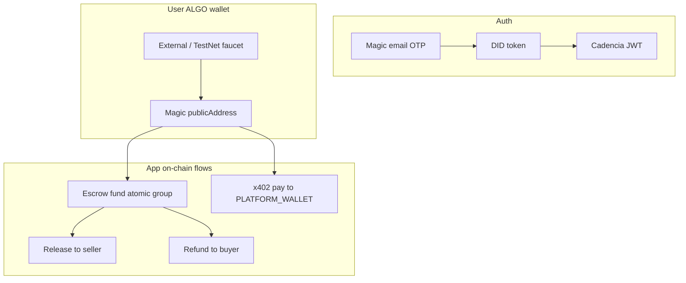
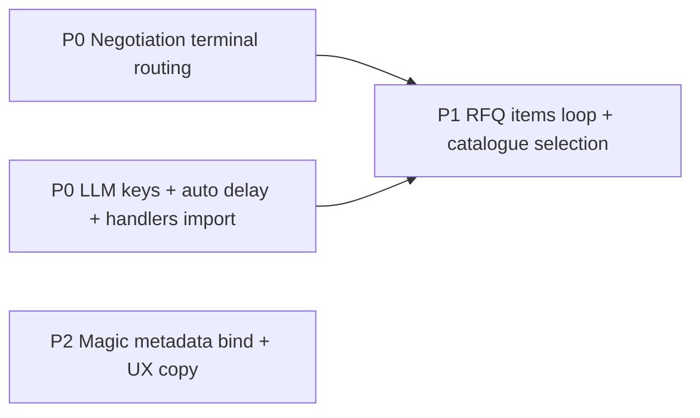

# Cadencia Codebase Audit Report

This audit was performed against [cadencia-magic-wallet-main](c:\Users\omen\OneDrive\Desktop\cadencia-magic-wallet-main) by tracing negotiation, marketplace, LLM drivers, and wallet flows in source (not running production).

---

## 1. Negotiation engine — intended design vs standard agents

### How your engine is designed (DANP)

Cadencia uses a **neutral mediator** pattern (not peer-to-peer LLM bargaining):



Core files:

- FSM: [backend/src/negotiation/domain/session.py](backend/src/negotiation/domain/session.py) — seller-first: `INIT → SELLER_ANCHOR → BUYER_RESPONSE → ROUND_LOOP`
- Orchestration: [backend/src/negotiation/application/services.py](backend/src/negotiation/application/services.py)
- 4-layer engine: [backend/src/negotiation/infrastructure/neutral_engine.py](backend/src/negotiation/infrastructure/neutral_engine.py)
- LLM driver: [backend/src/negotiation/infrastructure/llm_agent_driver.py](backend/src/negotiation/infrastructure/llm_agent_driver.py)

### How standard negotiation agents typically work

| Standard practice | Your implementation | Gap |
|-------------------|----------------------|-----|
| Explicit **terminal reason** (agreed / timeout / impasse / max_rounds) | `is_terminal` bool + string grep on `agent_reasoning` | **Missing enum** — causes wrong outcomes |
| **Reservation prices** hidden; offers alternate | Valuation + strategy set band; LLM ±3%; guardrails | Aligned |
| **ZOPA** computed once and persisted | `_zopa_cache` in-memory on `NeutralEngine` | Lost on restart / multi-pod |
| **Convergence** before AGREED | `check_convergence()` + crossed-ZOPA in engine | OK when terminal routing is correct |
| **Stall → human review**, not fake deal | `STALLED` state exists | **Broken routing** marks AGREED instead |
| **Mediator does not “agree” on exhaustion** | Max rounds sets `is_terminal` with no reason tag | **Defaults to agreement** |
| Tests/mocks match production FSM | Tests expect `BUYER_ANCHOR` first | **Drift** |

Reference: automated mediation / bilateral alternating offers with BATNA-ZOPA (Rubinstein-style concession curves) — your `StrategyEngine` + `BayesianOpponentModel` align; the **orchestration layer** is where behavior diverges from intent.

---

### Critical negotiation bugs (verified)

#### Bug N1 — Max rounds incorrectly ends as AGREED (High)

When `round_count + 1 >= MAX_ROUNDS`, [neutral_engine.py](backend/src/negotiation/infrastructure/neutral_engine.py) sets `is_terminal = True` with **no** `REJECT`, `WALK_AWAY`, or `TIMEOUT` in reasoning.

[services.py](backend/src/negotiation/application/services.py) terminal branch:

```393:404:backend/src/negotiation/application/services.py
        if is_terminal:
            reasoning = offer.agent_reasoning or ""
            if "REJECT" in reasoning or "WALK_AWAY" in reasoning:
                ...
            elif session.stall_counter >= 3:
                await self._handle_stall(session)
            else:
                await self._handle_agreement(session, offer, buyer_profile, seller_profile)
```

**Symptom:** 20-round sessions close as **AGREED** without convergence.

**Fix (minimal, existing patterns):** Tag terminal offers in `neutral_engine.py` when setting `is_terminal` (same pattern as walk-away strings already used):
- Max rounds → `agent_reasoning` contains `"TIMEOUT"` or `"MAX_ROUNDS"`
- Post-recovery stall → `"STALL_TERMINAL"` (do **not** call `reset_stall_counter()` before the service checks stall, **or** route on reasoning instead of `stall_counter`)

Update `run_agent_turn()` to check reasoning **before** the `stall_counter >= 3` branch (order matters).

#### Bug N2 — Stall-after-recovery → AGREED (High)

On true stall, engine sets `is_terminal` but calls `reset_stall_counter()` on recovery path; on final stall turn `stall_counter` may be **0**, so service hits `_handle_agreement`.

**Fix:** Same as N1 — explicit reasoning tag `"STALL_TERMINAL"` and handler branch in `services.py`; optionally call `_handle_stall()` when reasoning contains that tag regardless of counter.

#### Bug N3 — Guardrail violations increment schema failure counter (Medium)

In [neutral_engine.py](backend/src/negotiation/infrastructure/neutral_engine.py), guardrail violations call `session.record_schema_failure()` — same counter as invalid LLM JSON → premature `POLICY_BREACH`.

**Fix:** Only call `record_schema_failure()` for LLM parse/validation failures; log guardrail overrides separately (existing `log.warning` pattern).

#### Bug N4 — ZOPA cache not persisted (Medium)

`_zopa_cache` on `NeutralEngine` — deal quality and weighted settlement depend on it; restart = wrong/missing ZOPA metadata.

**Fix (no new subsystem):** Persist ZOPA floor/ceiling on existing session JSONB (`opponent_beliefs` column pattern already used in migration 016) or add two nullable columns via existing Alembic pattern — read/write in `process_turn()` instead of dict cache only.

#### Bug N5 — Profile learning uses buyer offer price after agreement (Low)

`_handle_agreement` correctly uses `agreed_amount` for SSE but `update_after_session(..., final_price=offer.price.amount)` still uses buyer bid.

**Fix:** Pass `agreed_amount` (already computed in same method).

#### Bug N6 — Seller-first FSM vs tests/mocks (Medium — causes confusion, not always prod bug)

- Production: `activate()` → `SELLER_ANCHOR` ([session.py:163-172](backend/src/negotiation/domain/session.py))
- Stale comment in services: "INIT → BUYER_ANCHOR"
- Unit tests in [test_domain.py](backend/tests/unit/negotiation/test_domain.py) / [test_infrastructure.py](backend/tests/unit/negotiation/test_infrastructure.py) expect buyer-first
- Frontend mock [negotiation.ts](frontend/src/mocks/handlers/negotiation.ts) — buyer round 1

**Fix:** Align tests and mocks to seller-first (no production logic change if already deployed).

#### Bug N7 — Layer violation in RFQ/catalogue load (Medium)

`NegotiationService._load_rfq_and_catalogue()` uses `session_repo._session` and marketplace ORM directly — fragile across repos.

**Fix:** Use existing `get_db_session()` on repository if exposed (BUG-07 notes this); keep logic, fix access path only.

#### Bug N8 — LLM exhaustion → StubAgentDriver (Operational)

After all keys/retries fail, [llm_agent_driver.py](backend/src/negotiation/infrastructure/llm_agent_driver.py) raises `LLMExhaustedException`; service falls back to deterministic stub offers — looks like “negotiation broken” to users.

**Fix:** Surface terminal `POLICY_BREACH` or `TIMEOUT` with user-visible message instead of silent stub bargaining (reuse existing `_handle_policy_breach` / event publish paths).

---

### Negotiation fix plan (minimal new code)

| Priority | File(s) | Change |
|----------|---------|--------|
| P0 | `neutral_engine.py`, `services.py` | Terminal reason via `agent_reasoning` tags + ordered handler branches |
| P0 | `neutral_engine.py` | Do not reset stall counter on terminal stall turn (or tag + route on tag) |
| P1 | `neutral_engine.py` | Split schema vs guardrail failure counters (use existing `schema_failure_count` only for schema) |
| P1 | `neutral_engine.py` + session persistence | Persist ZOPA from cache to session row |
| P2 | `services.py` | `final_price=agreed_amount` in profile update |
| P2 | Tests + frontend mocks | Seller-first alignment |
| P2 | `services.py` | On `LLMExhaustedException`, fail session visibly vs stub loop |

**Do not add** a new negotiation framework, agent classes, or external libraries — extend existing FSM, reasoning strings, and handlers only.

---

## 2. API key rotation — “limit reached” in production

### What exists today

| Code path | Groq rotation | Gemini rotation |
|-----------|---------------|-----------------|
| Negotiation LLM | `GROQ_API_KEY` + `_2`…`_7`, deduped | **`GEMINI_API_KEY` only** — no `_2` |
| RFQ parse + embed | `_2`…`_7` (no dedup) | Chat: `_2`; embed: rotates |
| Agent memory embed | N/A | **Single key**, no rotation |

Rotation logic in [llm_agent_driver.py](backend/src/negotiation/infrastructure/llm_agent_driver.py) only retries on `openai.RateLimitError`; other quota errors hit generic `Exception` and still rotate keys but may exhaust quickly.

### Why rotation fails in production (verified root causes)

1. **Keys not loaded in prod env** — Deploy uses `BACKEND_ENV_B64` → `.env.production`; [docker-compose.cloud.yml](docker-compose.cloud.yml) only documents one `GROQ_API_KEY`. Rotation is a no-op with one client.
2. **Gemini negotiation ignores `GEMINI_API_KEY_2`** — [lines 249-262](backend/src/negotiation/infrastructure/llm_agent_driver.py) vs RFQ parser which uses `_2`.
3. **Background auto-negotiation has no inter-turn delay** — [marketplace/services.py `_run_auto_negotiation_standalone`](backend/src/marketplace/application/services.py) loops `run_agent_turn` with **no** `AUTO_TURN_DELAY_SECONDS`; only [negotiation/api/router.py `run-auto`](backend/src/negotiation/api/router.py) sleeps 1.5s. Production match → many sessions × 2 agents × fast loop = all keys rate-limited together.
4. **`LLM_RATE_LIMIT_*` in `.env.example` is never implemented** — documented 50 req/min cap does not exist in code.
5. **Health check always pings OpenAI** — [health/router.py](backend/src/health/router.py) uses `OPENAI_API_KEY` even when `LLM_PROVIDER=groq|gemini`.
6. **Broken import breaks seller embeddings** — [handlers.py:935](backend/src/shared/infrastructure/events/handlers.py) imports non-existent `document_parser`; should be `rfq_parser.get_document_parser` — seller profile re-embed path fails at runtime.
7. **Embedding_pipeline zero vectors on failure** — corrupts RAG/matching silently.
8. **Deploy verification weak** — `grep -c GROQ_API_KEY` counts comment lines and `_2` suffix lines alike.

### Fix plan (minimal)

| Priority | Action |
|----------|--------|
| P0 | **Ops:** Ensure `.env.production` has non-empty distinct `GROQ_API_KEY`, `GROQ_API_KEY_2`… and `GEMINI_API_KEY`, `GEMINI_API_KEY_2` |
| P0 | **Code:** Mirror Groq `extra_api_keys` pattern for Gemini in `get_agent_driver()` (copy `_2` loop from [rfq_parser.py](backend/src/marketplace/infrastructure/rfq_parser.py)) |
| P0 | **Code:** Add `await asyncio.sleep(float(os.getenv("AUTO_TURN_DELAY_SECONDS", "1.5")))` in `_run_auto_negotiation_standalone` between turns (same env as router) |
| P0 | **Code:** Fix `handlers.py` import → `rfq_parser` |
| P1 | **Code:** In `llm_agent_driver.py`, treat `APIStatusError` with 429/403 quota body like `RateLimitError` (extend existing except block, no new module) |
| P1 | **Code:** Dedup Groq keys in `rfq_parser.py` like driver; strip primary key |
| P1 | **Code:** Reuse `_gemini_embed` rotation pattern in `embedding_pipeline.py` |
| P1 | **Ops:** Fix health check to use active `LLM_PROVIDER` key |
| P2 | Document `GEMINI_API_KEY_2` in `.env.example`; remove duplicate conflicting `LLM_PROVIDER` lines |

---

## 3. Multi-product and catalogue-specific RFQs

### Pipeline (single path for all RFQs)

`POST /v1/marketplace/rfq` → parse → embed → match → negotiate. No separate catalogue RFQ API.

### Root cause A — Multi-product `items[]` is parse-only (High)

- LLM schema in [rfq_parser.py](backend/src/marketplace/infrastructure/rfq_parser.py) includes `items[]`
- **Zero** `parsed.get("items")` usage under `backend/src/marketplace` (grep confirmed)
- Matching uses only top-level `product`, `quantity`, `budget_*`
- Stub parser always sets `items: null`

**Symptom:** “Sony + Nikon + DJI” RFQ matches on one arbitrary `product` line; rest ignored for match + negotiation.

**Fix options (minimal code, pick one):**

- **Option A (smallest):** In `_parse_and_match_standalone`, if `parsed.get("items")` is a non-empty list, loop each item: build synthetic single-product `parsed_fields` per item, run existing `find_matches` / `find_enhanced_matches`, merge/dedupe matches (reuse existing match save_bulk).
- **Option B:** Reject multi-product at API with clear error until full support — honest UX, no silent failure.

Recommendation: **Option A** using existing matchmakers per item (no new matchmaker class).

### Root cause B — Catalogue/product-specific matching (High)

| Issue | Detail |
|-------|--------|
| `product_category` never extracted | Parser schema has no field; enhanced matcher filters `CatalogueItemModel.product_category == product_category` when present ([pgvector_matchmaker.py:194-195](backend/src/marketplace/infrastructure/pgvector_matchmaker.py)) |
| `delivery_window_days` never set from parse | Parser outputs `delivery_window_start/end`; DB expects `delivery_window_days` — delivery hard filter often skipped |
| `best_item = catalogue_items[0]` | First DB row, not product/HSN match — wrong MOQ/price filters for multi-SKU sellers |
| `matched_catalogue_item_id` | Set from `best_item` — wrong if `best_item` is wrong |
| Unit mismatch | Capacity/MOQ in MT vs piece-based RFQs (cameras) hard-filter valid sellers |

**Symptom:** General commodity RFQ works; specific SKU / catalogue RFQ gets **PARSED** with no matches or wrong seller.

**Fix plan (reuse existing fields):**

1. **Parser:** Add `product_category` and `delivery_window_days` to `RFQ_EXTRACTION_SCHEMA` + map from `delivery_window_start/end` in `_normalize` helper (same file as budget normalize).
2. **pgvector_matchmaker:** Select `best_item` by `product_name`/`hsn_code` ilike match to `rfq_product` before MOQ/price checks (mirror negotiation tier-2 logic in [services.py:177-190](backend/src/negotiation/application/services.py)).
3. **MOQ/capacity:** Skip MT capacity hard filter when RFQ/catalogue units are not MT (check `unit` on catalogue row if present).
4. **Negotiation:** Already has 4-tier catalogue selection — fix upstream match `matched_catalogue_item_id` so tier 1 works.

### Root cause C — Negotiation is single-SKU (Medium)

`NeutralEngine` rfq_ctx uses one `product`; no per-line sessions for multi-product RFQs.

**Fix:** After Option A matching, create **one negotiation session per match line** (existing `create_session` from marketplace auto-start) — no new session type.

---

## 4. Magic wallet architecture and fund flows

### Architecture assessment: **Mostly correct**



Key files:

- Frontend: [frontend/src/lib/magic.ts](frontend/src/lib/magic.ts), [AuthContext.tsx](frontend/src/context/AuthContext.tsx), [WalletContext.tsx](frontend/src/context/WalletContext.tsx)
- Backend: [magic_auth.py](backend/src/identity/api/magic_auth.py), [settlement/router.py](backend/src/settlement/api/router.py), [algorand_gateway.py](backend/src/settlement/infrastructure/algorand_gateway.py)

**Correct:**

- Non-custodial: keys stay in Magic; backend verifies DID via `magic-admin`
- Escrow: buyer signs fund group → `submit-signed-fund` → chain + DB `FUNDED`
- Release/refund: client-signed app calls

**Gaps:**

| Issue | Risk |
|-------|------|
| DID verified but `body.email` / `body.algo_address` not compared to Magic metadata | Account linking spoofing |
| `linkWallet({ magic_address: true })` incompatible with backend challenge/signature | Manual link broken; relies on `magic_login` auto-link |
| `signAlgoTxnGroup` signs txns individually | Possible atomic group failure on-chain |
| No in-app Magic on-ramp | Users must fund via faucet (test) or external transfer |
| Treasury/MoonPay | Internal liquidity — **not** user Magic wallet deposit/withdraw |
| Stale Pera UI copy | Confusing UX |

### How funds move in/out (answer to your question)

| Direction | Mechanism |
|-----------|-----------|
| **Into Magic wallet** | External ALGO transfer or TestNet faucet (linked in wallet UI) — **not** Magic fiat on-ramp in this repo |
| **Out to escrow** | Buyer signs fund payment + app call → escrow app account |
| **Out via x402** | Micropayment to `PLATFORM_WALLET` for gated APIs |
| **Back from escrow** | Refund path to buyer Magic address; release to seller on-chain address |
| **Treasury** | DB accounting only — separate from embedded wallet |

### Should the website let users add/remove funds?

**Yes, at the UX layer** — but with clear separation:

1. **Add funds:** Show Magic address + QR/copy + TestNet faucet link (dev) / mainnet on-ramp partner (prod) — you do not implement Magic’s fiat ramp in code today; that is a **product/design** choice, not a backend bug.
2. **Remove funds:** Optional “withdraw to external address” flow = standard Algorand payment txn signed by Magic (reuse `signAlgoTxn` + new thin API to build unsigned payment) — **not** required for escrow trade loop.
3. **Trade funds:** Keep escrow fund/release/refund as primary in-app flows ([WalletContext](frontend/src/context/WalletContext.tsx)) — this is the core B2B settlement path.

**Security fixes before promoting fund UX:** Bind Magic metadata email/address to request body in [magic_auth.py](backend/src/identity/api/magic_auth.py); validate fund submit signer == enterprise linked wallet.

---

## 5. Additional issues (negotiation + related)

| ID | Issue | Fix |
|----|-------|-----|
| N9 | In-memory `_belief_cache` duplicate of session JSONB | Prefer session `opponent_beliefs` only (already persisted) |
| N10 | `IOpponentProfileRepository` implemented but not wired in DI | Wire or remove dead code |
| N11 | SSE test expects engine to publish; engine delegates to service | Fix test expectation |
| N12 | Auto-negotiation swallows turn errors and breaks loop silently | Log + terminal TIMEOUT on repeated LLM failure |
| N13 | Marketplace stagger 8s between sessions only — insufficient under load | Combine with per-turn delay (section 2) |
| N14 | `record_schema_failure` on guardrails (see N3) | See N3 |

---

## Recommended implementation order



1. **P0** — Negotiation terminal tags + handler order (fixes “engine not working”)
2. **P0** — Gemini multi-key in driver + auto-negotiation delay + `handlers.py` import
3. **P1** — RFQ `items` loop + `best_item` selection + parser fields for category/delivery
4. **P2** — Magic metadata binding, signer validation, UI cleanup (Pera → Magic)

---

## Verification checklist (after fixes)

- Single-product RFQ: still `MATCHED` → seller-first negotiation → `AGREED` only on convergence
- Max rounds session: ends `TIMEOUT` or `STALLED`, **not** `AGREED`
- Stall after recovery: ends `STALLED` / `HUMAN_REVIEW`
- Multi-product RFQ: N matches or N sessions (per chosen option)
- Catalogue RFQ with SKU name: `matched_catalogue_item_id` points to correct row
- Prod with 2+ Groq keys: logs show `total_keys > 1`; 429 rotates without immediate stub
- Magic login: email/address must match Magic metadata
- Escrow fund: only linked buyer address can submit signed fund tx
