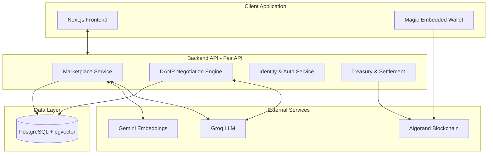
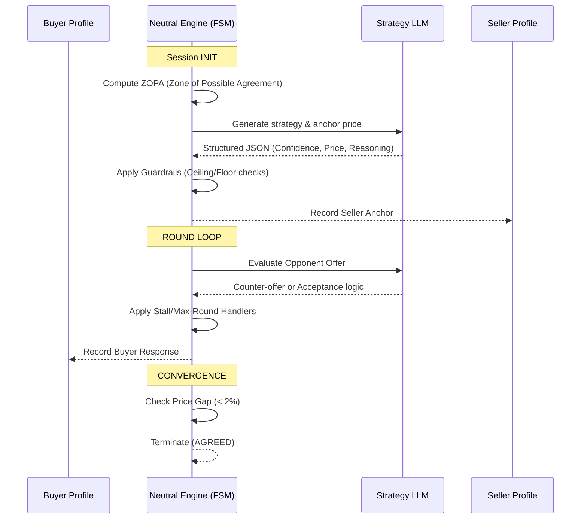
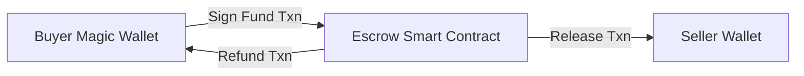

# Cadencia B2B A2A Platform


Cadencia is an Agent-to-Agent (A2A) B2B trading and settlement platform. It leverages Large Language Models (LLMs) to perform automated, multi-round bilateral negotiation through a Neutral Mediator engine, and settles agreements securely on-chain via Algorand escrow smart contracts.

## System Architecture

The platform follows a modular, microservices-inspired monolithic architecture built on modern web technologies.



## Core Components

### 1. Dynamic Agentic Negotiation Protocol (DANP)
Cadencia implements a **Neutral Mediator** pattern rather than peer-to-peer LLM bargaining. This ensures strict adherence to guardrails, monotonic pricing, and verifiable termination states.



**Key Features:**
- **ZOPA Persistence**: Maintains stateful awareness of the Zone of Possible Agreement across sessions.
- **Strict Routing**: Enforces hard stops via `MAX_ROUNDS`, `STALL_TERMINAL`, and `POLICY_BREACH` tags to prevent infinite loops.
- **Provider Redundancy**: Supports key rotation across multiple Groq and Gemini API keys to mitigate rate limits during concurrent execution.

### 2. Marketplace & RFQ Pipeline
The Request for Quotation (RFQ) pipeline uses a hybrid semantic-keyword retrieval approach.

- **Extraction**: LLMs parse unstructured RFQ text into a deterministic schema (Product, Quantity, Budget, Delivery Window, HSN code).
- **Embeddings**: `gemini-embedding-2` maps product requests to a 1536-dimensional vector space.
- **Matching**: `pgvector` performs cosine similarity searches against the vendor catalogue, combined with hard filters for delivery constraints.

### 3. Settlement & Escrow
Settlement is enforced on the Algorand blockchain, removing counterparty risk. User wallets are managed via non-custodial embedded infrastructure.



- **Identity**: Users authenticate via Magic.link email OTP. A DID token is exchanged for a stateless JWT.
- **Escrow**: Atomic transaction groups bind the negotiation outcome to an on-chain escrow instance.
- **x402**: Pay-per-use APIs utilize x402 payment protocol micro-transactions to the platform treasury.

## Technical Stack

- **Frontend**: Next.js 15, React 19, Tailwind CSS, shadcn/ui, Magic SDK.
- **Backend**: Python 3.12, FastAPI, SQLAlchemy, Alembic.
- **Database**: PostgreSQL with `pgvector` extension.
- **AI/LLM**: Groq (`llama-3.3-70b-versatile`), Gemini.
- **Blockchain**: Algorand SDK, Pera Wallet polyfills.

## Deployment & Infrastructure

The application is fully containerized and orchestrated via Docker Compose.

- **CI/CD**: GitHub Actions automate the build and deployment process to an AWS EC2 instance.
- **Reverse Proxy**: Caddy server provides automated HTTPS/TLS termination and routes traffic to the respective containers.
- **Environment Management**: Secrets are injected securely via GitHub Actions using base64-encoded environment variables (`BACKEND_ENV_B64`).

### Local Development

1. **Clone the repository.**
2. **Environment Setup**: Copy `.env.example` to `.env.local` and populate necessary keys (Database URL, Groq/Gemini API keys, Magic Publishable Key).
3. **Run Services**:
   ```bash
   docker compose -f docker-compose.local.yml up --build
   ```
4. **Database Migrations**:
   ```bash
   docker exec -it <backend-container-name> alembic upgrade head
   ```
