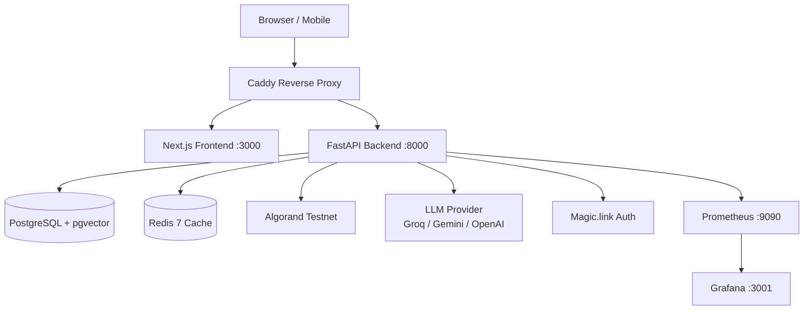
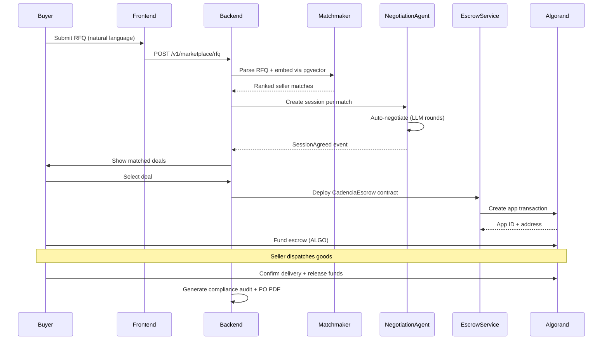
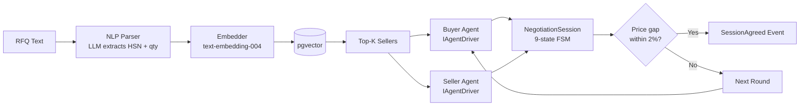
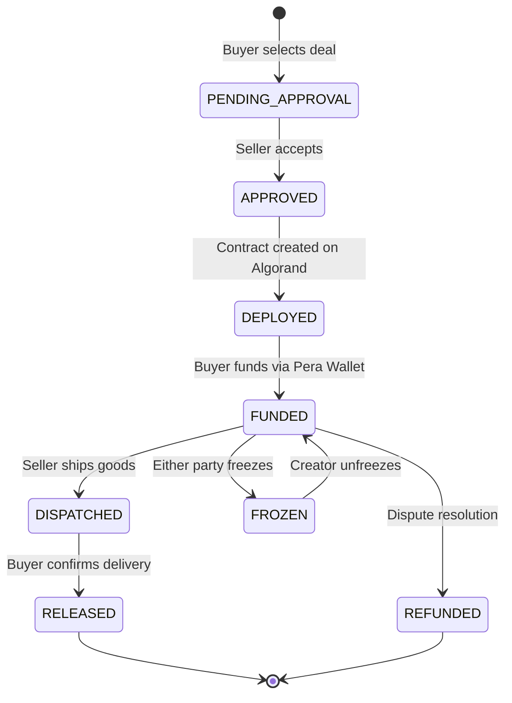
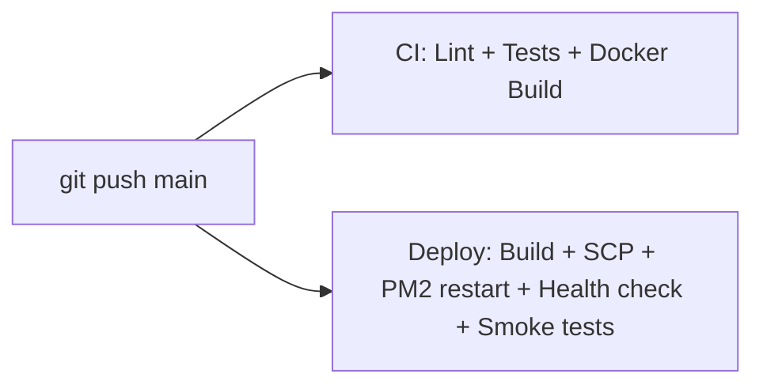

# Cadencia — Architecture Documentation

## System Architecture



## Procurement Workflow



## Negotiation Engine Architecture



### Negotiation Engine Layers

| Layer | Component | Purpose |
|-------|-----------|---------|
| 1 | Valuation Engine | Computes reservation price, target price, walkaway delta |
| 2 | Strategy Engine | Selects strategy per round (anchor, boulware, tit-for-tat, ultimatum) |
| 3 | Opponent Model | Bayesian belief updates (cooperative, strategic, stubborn, bluffing) |
| 4 | Guardrail Engine | Validates offers against budget ceiling, margin floor, confidence |

## Escrow Smart Contract Lifecycle



## Domain Architecture (Hexagonal / DDD)

Each backend domain follows:

```
<domain>/
├── api/              # FastAPI routers (inbound adapters)
├── application/      # Use case services + commands
├── domain/           # Pure models, value objects, events
└── infrastructure/   # ORM models, repositories, external adapters
```

**Domains:** admin, compliance, health, identity, marketplace, messaging, negotiation, procurement, settlement, shared, treasury, wallet

## Database Schema (Key Tables)

| Table | Purpose |
|-------|---------|
| `enterprises` | Buyer/seller company profiles |
| `users` | Enterprise user accounts (Magic.link auth) |
| `capability_profiles` | Seller embeddings for pgvector matching |
| `catalogue_items` | Seller product catalogue |
| `rfqs` | Buyer request for quotations |
| `matches` | RFQ-to-seller match records |
| `negotiation_sessions` | 9-state FSM negotiation lifecycle |
| `offers` | Individual negotiation round offers |
| `escrow_contracts` | Algorand escrow lifecycle |
| `audit_entries` | Hash-chained compliance audit log |
| `procurement_documents` | Purchase order records |
| `x402_payments` | Micropayment ledger |

## CI/CD Pipeline



## External Dependencies

| Service | Purpose | Failover |
|---------|---------|----------|
| PostgreSQL + pgvector | Primary database | Docker local |
| Redis 7 | Cache + rate limiting | In-memory dev |
| Algorand testnet | Smart contract settlement | AlgoKit localnet |
| Groq API | LLM inference (primary) | Gemini / OpenAI fallback |
| Gemini text-embedding-004 | Vector embeddings | Required |
| Magic.link | Passwordless auth + wallet | RS256 JWT standalone |
